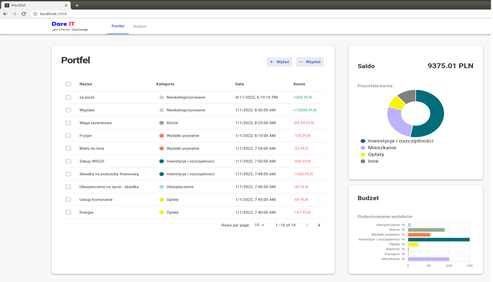
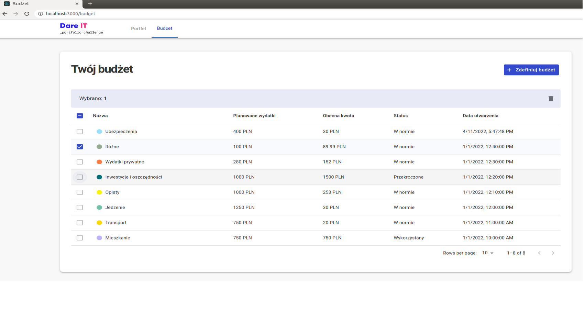
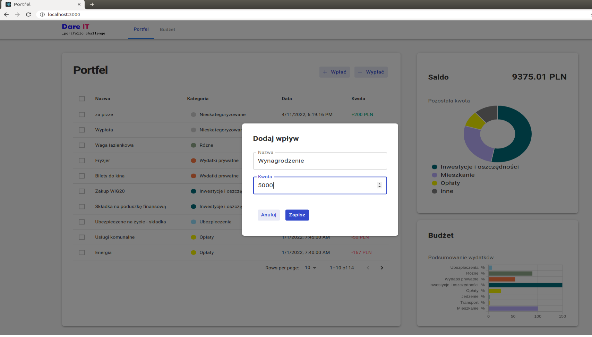
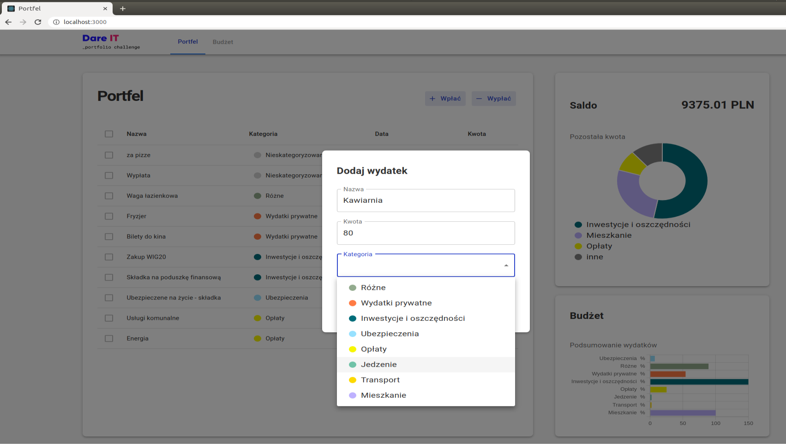
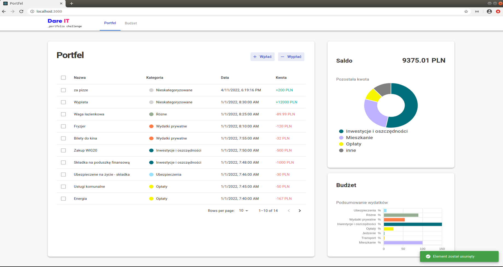
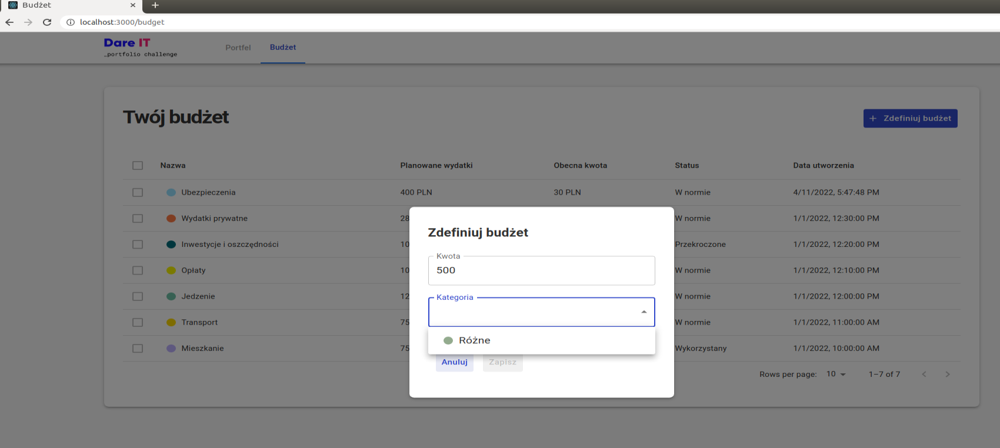
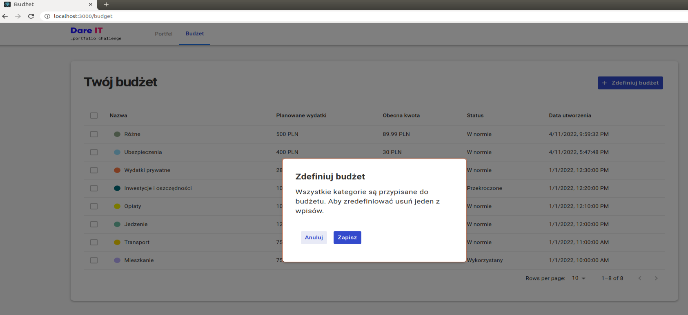

# Dare IT React Challange




## Table of Contents
* [General Info](#general-information)
* [Technologies Used](#technologies-used)
* [Features](#features)
* [Application View](#application-view)
* [How to Use](#how-to-use)
* [Project Status](#project-status)
* [Room for Improvement](#room-for-improvement)
* [Acknowledgements](#acknowledgements)
* [Contact](#contact)

## General Information

The project was made as part of the Ract Dare IT challenge. The organizer has prepared a repository with the client application and the server supplying the front-end application with data. During the challenge, we received tasks aimed at developing the application from the front-end.

My motivation was to get to know the capabilities of the React library and experience working in real conditions.
Participation in this project enriched my knowledge and allowed to use it in practice. One of the most valuable experiences was the code review. Received feedback quickly explained the mistakes made, but also allowed to see the solution from the perspective of an experienced developer.

I gained new skills:
- work with MUI - React components library,
- communication with the server using REST API,
- state handling: error, loader, no content,
- data visualisation using react-chartjs-2. I created and rendered a bar and doughnut chart,
- created notifications for user using notistick.

I learned how to use the React Hook Form library to validate data entered into the form.
 
A budget management application was made, consisting of 2 pages:
1. Wallet (Portfel) -the page presents:
    - buttons: add income (+ Wpłać) and add expens (- Wypłać)
    - table of operations performed by the user. It containes: name, category name, create at an amount in PLN.
    - Summary Chart (Saldo) presents 3 categories with bigest expenses plus the last one with sum of the rest categories.  
    - Budget Chart (Budżet) shows in "%" the use of the planned budget.  

2. Budget (Budżet) - the page presents table containes: Category Name (Nazwa), amount (Zaplanowane wydatki), current amount (Obecna kwota), status and create at (Data utworzenia). 

## Technologies-used

[](https://nodejs.org/en/)
[](https://www.npmjs.com/)

[](https://reactjs.org/)
[](https://react-query.tanstack.com/)
[](https://mui.com/)

[](https://swagger.io/)
[](https://www.cypress.io/)
- [react-hook-form](https://react-hook-form.com/)
- [notistack](https://github.com/iamhosseindhv/notistack)

## Features

1. Wallet (portfel) - the user can:
    - delete selected records,
    - add a income using the button "+ Wpłać", 
    - add an expense using the button "- Wypłać", 
    - Summary Chart (Saldo) presents 3 categories with bigest expenses plus the last one with sum of the rest categories.  Additional you can see account balance on the chart.
    - Budget Chart (Budżet) shows in "%" the use of the planned budget. 

2. Budget (budżet) - the user can:
    - define the budget of the selected category.
    - The status ("normal, used, exceeded") shows the user at what level the budget is used. The user can control his expenses.
    - delete selected records,

On the both pages:
- the user receives notifications in response to performed actions,
- form validation has been added.
    
## Application View







## How to Use
To clone and run this application, you'll need [Git](https://git-scm.com) and [Node.js](https://nodejs.org/en/download/) (which comes with [npm](http://npmjs.com)) installed on your computer. From your command line:

```bash
# Clone this repository
$ git clone https://github.com/AneczkaH/react-challenge

# Go into the repository
$ cd react-challenge

# Install dependencies
$ npm install

# Run the app
$ npm start
```
- client - react application - http://localhost:3000
- server - backend application - http://localhost:4320
    - API documentation is available at http://localhost:4320/swagger

## Project Status
Project is in progress.

## Room for Improvement
Room for improvement:
- improve the styling of the button component
- improve SummaryChart - displaying the value in PLN.

To do:
- additional notification when the status is "Exceeded" ("Przekroczony"),
- add category "Income",
- add the possibility of updating records,
- add the possibility of sorting data on the Portfolio page,
- add the possibility of filtering or searching by: category, amount, selected period,
- add ability to customize category names,
- add user account with login and authentication. 

## Contact
Created by [AneczkaH](https://github.com/AneczkaH) - feel free to contact me!
